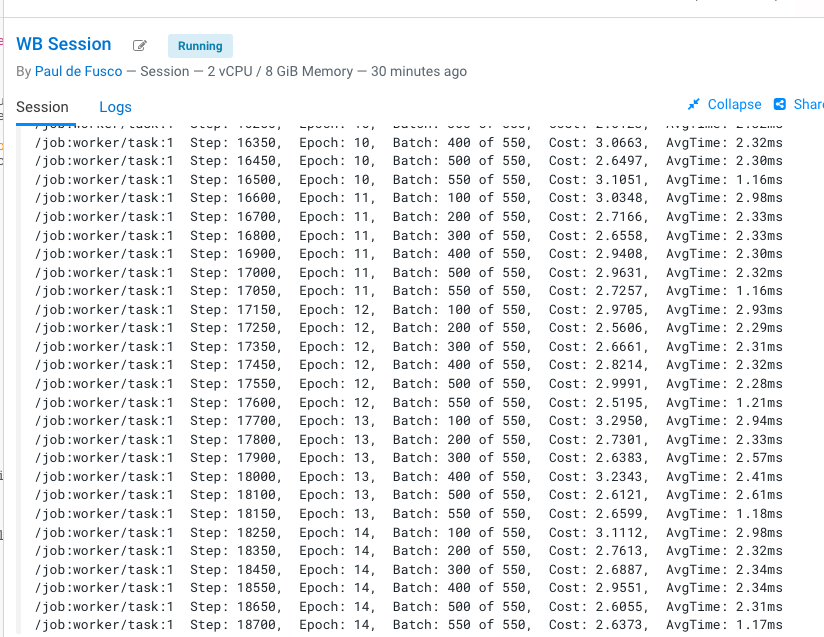
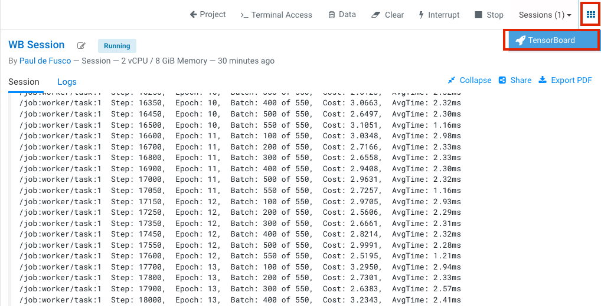
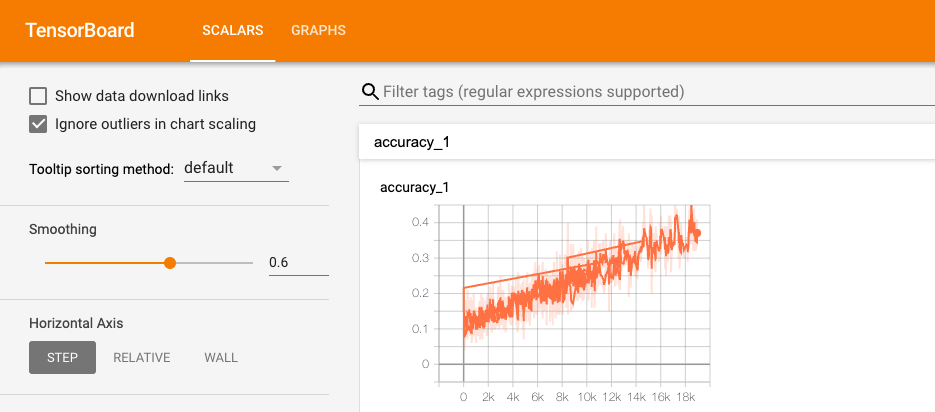

# Implementing distributed model training for deep learning with Cloudera Machine Learning

This repository references the Cloudera Blog Article and Distributed Tensorflow example authored by Zuling Kang, Machine Learning Senior Solutions Architect at Cloudera.

It is highly recommended that you review the article before proceeding with the tutorial, but it is not required. You can find the article at [this link](https://blog.cloudera.com/implementing-distributed-model-training-for-deep-learning-with-cloudera-machine-learning/).

### Cloudera Machine Learning

Cloudera Machine Learning is Cloudera’s cloud-native machine learning platform built for CDP. Cloudera Machine Learning unifies self-service data science and data engineering in a single, portable service as part of an enterprise data cloud for multi-function analytics on data anywhere.

It empowers organizations to build and deploy machine learning and AI capabilities for business at scale, efficiently and securely, anywhere they want. It’s built for the agility and power of cloud computing, but isn’t limited to any one cloud provider or data source.

For an overview of CML, please visit the [documentation](https://docs.cloudera.com/machine-learning/cloud/product/topics/ml-product-overview.html).

For an introductory CML Tutorial where you can test basic features such as Projects, Sessions, and more please visit the [CML Crash Course Repository](https://github.com/pdefusco/CML_CrashCourse).

### Distributed Computing in CML

You can use CML's built in Workers API to distribute training of ML models across multiple nodes. Any R or Python session can be used to spawn workers. These workers can be configured to run a script (e.g. a Python file) or a command when they start up.

The Workers API is framework agnostic. You don't have to use Tensorflow only as shown in this project. For example you can use it for Distributed XGBoost on Dask as shown in this other [example project](https://github.com/pdefusco/dask_distributed_xgboost_example).

To learn more about how to implement Distributed Computing in CML please visit the [documentation](https://docs.cloudera.com/machine-learning/cloud/distributed-computing/topics/ml-parallel-computing.html).

### Instructions for Use

Launch a CML Session with the following settings:

* Editor: Workbench
* Kernel: Python 3.7
* Edition: Standard 
* Enable Spark: Disabled
* Resource Profile: 2 vCPU / 4 GiB Mem recommended
* All other options can be left to their default values

Open the "distributed-mnist.py" script and execute all the code at once by pressing on the "play" button.

Observe model training on the right side of your screen. This should take a couple of minutes at most. 

When model training is you can open Tensorboard as shown below.

You can use Tensorboard to develop Tensorflow expeirments, track metrics, and more. 

